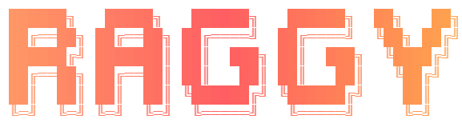

# Raggy - Universal RAG System

A powerful, drop-in RAG (Retrieval-Augmented Generation) solution with hybrid search and AI development memory.

## Quick Start

### Installation

```bash
pip install raggy
```

### Basic Usage

**Document Search (RAG System):**

```python
from raggy import UniversalRAG

# Initialize with your documents directory
rag = UniversalRAG(docs_dir="./docs")

# Build the vector database
rag.build()

# Search your documents
results = rag.search("machine learning algorithms", top_k=5)

for result in results:
    print(f"Score: {result['score']:.2f}")
    print(f"File: {result['file']}")
    print(f"Content: {result['content']}\n")
```

**Development Memory (New in v2.0):**

```python
from raggy import Memory, remember, recall

# Store development context
mem_id = remember(
    "Decided to use ChromaDB for vector storage because it's lightweight",
    memory_type="decision",
    tags=["architecture", "database"]
)

# Retrieve memories
results = recall("database decisions", limit=5)

for memory in results:
    print(f"[{memory['type']}] {memory['content']}")
    print(f"Tags: {', '.join(memory['tags'])}\n")
```

### CLI Usage

**Document Search:**

```bash
# Initialize project (first time)
python raggy_cli.py init

# Build vector database
python raggy_cli.py build

# Search documents
python raggy_cli.py search "your query here"

# Hybrid search (semantic + keyword)
python raggy_cli.py search "api documentation" --hybrid
```

**Memory Management:**

```bash
# Store a memory
python raggy_cli.py remember "Fixed authentication bug in login handler"

# Recall memories
python raggy_cli.py recall "bug fix"

# Unified search (docs + memory)
python raggy_cli.py search "authentication" --include-memory
```

## Features

### Document Search (RAG)
- **Hybrid Search**: Combines semantic understanding with keyword matching
- **Smart Chunking**: Automatically splits documents for optimal retrieval
- **Multi-format Support**: PDF, DOCX, Markdown, and plain text
- **Normalized Scoring**: Interpretable 0-100 relevance scores
- **Query Expansion**: Automatically expands queries with synonyms

### Memory System (New in v2.0)
- **Context Persistence**: Store development decisions, solutions, and learnings
- **Type-based Organization**: Decisions, solutions, patterns, learnings, errors, notes
- **Tag-based Retrieval**: Categorize and find memories efficiently
- **Priority Levels**: Mark important memories with high/medium/low priority
- **Time-based Filtering**: Find recent memories or archive old ones
- **Unified Search**: Search both documents and memories together

### Cloud Vector Databases (New in v2.0)
- **ChromaDB**: Local-first, zero-config vector storage (default)
- **Pinecone**: Serverless cloud vector database with auto-scaling
- **Supabase**: PostgreSQL + pgvector for full-stack applications
- **OpenAI Embeddings**: High-quality embeddings with text-embedding-3-small/large
- **Interactive Setup**: Guided configuration wizard for cloud databases

### Model Presets
- **Fast**: Quick responses, lower accuracy (`paraphrase-MiniLM-L3-v2`)
- **Balanced**: Good balance of speed and accuracy (default)
- **Multilingual**: Support for 50+ languages
- **Accurate**: Best quality, slower processing

## Configuration

### Local Configuration (ChromaDB)

Create `.raggy.json` for local vector storage:

```json
{
  "vectorStore": {
    "provider": "chromadb",
    "chromadb": {
      "path": "./vectordb"
    }
  },
  "embedding": {
    "provider": "sentenceTransformers",
    "sentenceTransformers": {
      "model": "all-MiniLM-L6-v2"
    }
  }
}
```

### Cloud Configuration (Pinecone + OpenAI)

Create `.raggy.json` for cloud deployment:

```json
{
  "vectorStore": {
    "provider": "pinecone",
    "pinecone": {
      "apiKey": "${PINECONE_API_KEY}",
      "environment": "us-east-1-aws",
      "indexName": "raggy-index",
      "dimension": 1536
    }
  },
  "embedding": {
    "provider": "openai",
    "openai": {
      "apiKey": "${OPENAI_API_KEY}",
      "model": "text-embedding-3-small"
    }
  }
}
```

**Interactive setup wizard:**
```bash
python raggy_cli.py init --interactive
```

### Legacy YAML Configuration

Create `raggy_config.yaml` for custom settings:

```yaml
docs_dir: "./docs"
db_dir: "./vectordb"
model: "all-MiniLM-L6-v2"
chunk_size: 1000
chunk_overlap: 200
top_k: 5
```

## Advanced Usage

### Python API

```python
from raggy import UniversalRAG, Memory

# Custom configuration
rag = UniversalRAG(
    docs_dir="./my_docs",
    db_dir="./my_vectordb",
    model="all-MiniLM-L6-v2",
    chunk_size=1000,
    top_k=10
)

# Force rebuild database
rag.build(force_rebuild=True)

# Hybrid search with query expansion
results = rag.search(
    "machine learning",
    hybrid=True,
    expand_query=True
)

# Memory with metadata
memory = Memory(db_dir="./memory_db")
mem_id = memory.add(
    content="Refactored search engine to use dependency injection",
    memory_type="pattern",
    tags=["refactoring", "architecture", "search"],
    priority="high",
    files=["raggy/core/search.py", "raggy/core/rag.py"]
)

# Search with filters
results = memory.search(
    "refactoring patterns",
    memory_type="pattern",
    tags=["architecture"],
    since="2025-01-01",
    limit=10
)
```

### CLI Advanced Examples

```bash
# Query expansion + hybrid search
python raggy_cli.py search "api" --hybrid --expand

# JSON output for integration
python raggy_cli.py search "query" --json

# Multilingual model
python raggy_cli.py build --model-preset multilingual

# Memory with metadata
python raggy_cli.py remember "Bug fix" \
  --type solution \
  --tags "bug,fix,auth" \
  --priority high \
  --files "auth.py,login.py"

# Time-based recall
python raggy_cli.py recall "recent changes" --last 7d

# Archive old memories
python raggy_cli.py forget --archive --older-than 90d
```

## Requirements

### Core Requirements
- Python 3.8+
- ChromaDB 0.4.0+ (included by default)
- sentence-transformers 2.2.0+ (included by default)
- pypdf 6.2.0+ (for PDF support)
- python-docx 1.0.0+ (for DOCX support)

### Optional Cloud Database Support
- **Pinecone**: `pip install "raggy[pinecone]"` or `pip install pinecone[grpc]`
- **Supabase**: `pip install "raggy[supabase]"` or `pip install supabase`
- **OpenAI Embeddings**: `pip install openai` (for text-embedding-3-small/large)

## Documentation

Comprehensive guides and references:

### Getting Started
- [Setup Guide](./docs/setup-guide.md) - Quick setup for local and cloud deployments
- [Installation Guide](./docs/installation.md) - Detailed installation instructions
- [Quick Start Tutorial](./docs/quickstart.md) - Step-by-step tutorial
- [Configuration Guide](./docs/configuration.md) - All configuration options

### Core Features
- [Document Search (RAG)](./docs/rag-system.md) - RAG system documentation
- [Memory System](./docs/memory-system.md) - AI development memory guide
- [Vector Databases](./docs/vector-databases.md) - ChromaDB, Pinecone, Supabase guide
- [Hybrid Search](./docs/hybrid-search.md) - Semantic + keyword search
- [Query Expansion](./docs/query-expansion.md) - Automatic query enhancement

### API Reference
- [Python API Reference](./docs/api-reference.md) - Complete API documentation
- [CLI Reference](./docs/cli-reference.md) - All CLI commands
- [Memory API Quick Reference](./docs/MEMORY_API_QUICK_REFERENCE.md) - Memory system API

### Advanced Topics
- [Model Selection](./docs/model-selection.md) - Choosing the right model
- [Performance Tuning](./docs/performance.md) - Optimization guide
- [Custom Embedding Models](./docs/custom-models.md) - Using custom models
- [Integration Patterns](./docs/integration.md) - Integrating with your project

### Development
- [Contributing Guide](./docs/contributing.md) - How to contribute
- [Architecture Overview](./docs/architecture.md) - System design
- [Testing Guide](./docs/testing.md) - Running and writing tests

### Migration & Troubleshooting
- [Migration Guide](./docs/migration.md) - Upgrading from v1.x
- [Troubleshooting](./docs/troubleshooting.md) - Common issues and solutions
- [FAQ](./docs/faq.md) - Frequently asked questions

## License

MIT License - see LICENSE file for details

## Contributing

Contributions welcome! See [Contributing Guide](./docs/contributing.md) for details.

## Version

Current version: 2.0.0
